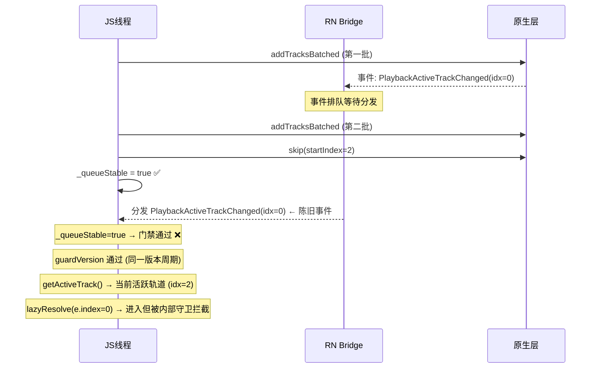
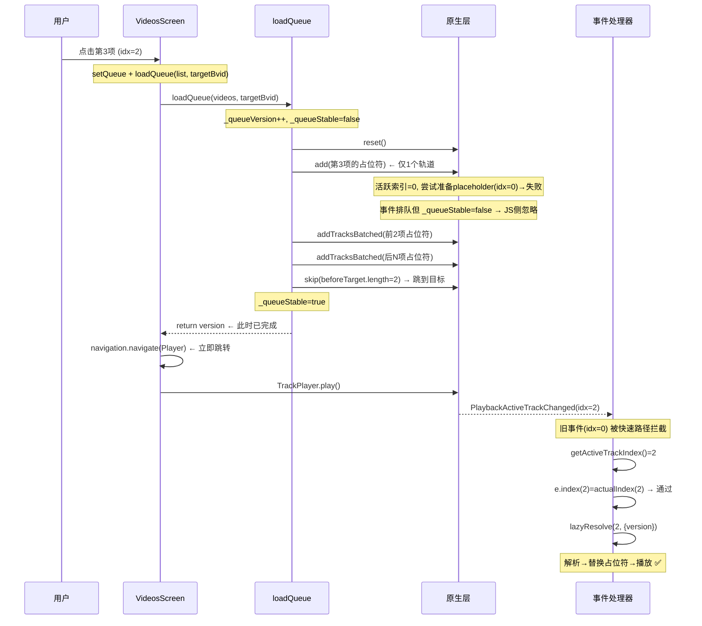

# 播放器初始化缺陷 - 根因分析与修复方案 v2

## 一、问题复述

在 VideosScreen 中点击索引 > 0 的音频项（如第3首）时：
1. **页面不会立即跳转**，而是先阻塞在 `loadQueue` 中
2. 控制台显示**首个音频（索引 0）的播放实例被创建**
3. 等待首个音频加载完成/失败后，才执行 `navigation.navigate('Player')`
4. 进入 PlayerScreen 后，目标音频才开始加载播放

预期行为：点击后立即跳转，仅在 PlayerScreen 中加载目标音频。

---

## 二、点击链路完整追踪

### 2.1 VideosScreen.playFrom (第 257-293 行)

```typescript
const playFrom = useCallback(async (idx: number) => {
  const target = displayedList[idx];                       // 获取目标项
  setQueue(displayedList, target.bvid, context);           // Step 1: 更新 Zustand
  await loadQueue(displayedList, target.bvid);              // Step 2: 阻塞操作 ← 问题所在
  navigation.navigate('Player');                            // Step 3: 导航（被 Step 2 阻塞）
  await TrackPlayer.play();                                 // Step 4: 播放
}, [...]);
```

### 2.2 loadQueue (第 193-226 行)

```typescript
export async function loadQueue(videos, startBvid) {
  const version = ++_queueVersion;
  _queueStable = false;
  await TrackPlayer.reset();                                // 清空原生队列
  const startIndex = Math.max(0, videos.findIndex(...));     // 计算目标索引
  const tracks = videos.map(buildPlaceholderTrack);         // 全部构建为占位符
  await addTracksBatched(tracks);                           // ← 第一道阻塞点
  await TrackPlayer.skip(startIndex);                       // ← 第二道阻塞点
  prefetchFirstTrack(startIndex).catch(() => {});
  return version;
  finally: _queueStable = true;
}
```

### 2.3 addTracksBatched (第 402-409 行)

```typescript
const BATCH_SIZE = 15;
async function addTracksBatched(tracks: any[]) {
  for (let i = 0; i < tracks.length; i += BATCH_SIZE) {
    const batch = tracks.slice(i, i + BATCH_SIZE);
    await TrackPlayer.add(batch);  // ← 每次 add 等待原生层完成
  }
}
```

---

## 三、根因分析

### 3.1 主根因：`TrackPlayer.add()` 在原生层同步准备首个轨道

**攻击链**：

```
addTracksBatched(tracks)
  └─ TrackPlayer.add(batch[0..14])              // 第一批包含索引 0
       └─ [原生层] 队列非空 → 自动设活跃轨道 = 0
       └─ [原生层] 创建 ExoPlayer MediaSource 实例，尝试准备索引 0 的轨道
       └─ [原生层] 索引 0 的 URL 为 placeholder://BVxxx，原生播放器无法识别
       └─ [原生层] 准备失败（或超时等待），Promise resolve
  └─ TrackPlayer.add(batch[15..29])             // 第二批
       ...
  └─ TrackPlayer.skip(startIndex)               // 跳转到目标索引
```

**关键发现**：

`react-native-track-player` 在 `add()` 操作时，原生层（Android ExoPlayer / iOS AVPlayer）会**主动尝试准备队列中首个/当前活跃的媒体源**。即使该轨道的 URL 是一个无效的 `placeholder://` 协议，原生层仍然会：

1. 尝试创建 `MediaSource` 实例（日志显示为"创建第一个音频的播放实例"）
2. 尝试解析 URL → 失败（因为 `placeholder://` 不是合法媒体协议）
3. 触发内部错误处理 → 默认行为可能是重试/等待超时

**这些操作全部发生在 `await TrackPlayer.add(batch)` 的 Promise 生命周期内**，因此 JS 线程被阻塞，导致：
- `loadQueue` 无法返回 → `navigation.navigate('Player')` 延迟执行
- 用户感知到"点击后不跳转，先加载首个音频"

### 3.2 次根因：`PlaybackActiveTrackChanged` 事件处理器存在冗余工作

**代码位置**：`trackPlayer.ts` 第 817 行

```typescript
TrackPlayer.addEventListener(Event.PlaybackActiveTrackChanged, async (e) => {
  // ... 门禁检查通过 ...
  const activeTrack = await TrackPlayer.getActiveTrack();  // 获取当前活跃轨道（正确）
  // ... 路径 B：占位符解析 ...
  await lazyResolve(e.index, { version: capturedVersion }); // ← 使用事件索引而非实际索引
});
```

**问题**：处理器已经通过 `getActiveTrack()` 获取了**当前真实活跃轨道**（例如索引 2 的目标轨道），但在调用 `lazyResolve` 时却使用了 `e.index`（陈旧事件的索引 0）。

**影响**：
- 虽然 `lazyResolve` 内部有 `if (activeIdx !== index) return;` 的守卫，但函数调用本身仍然经过了参数传递、Promise 创建、微任务调度等开销
- 更重要的是，**`lazyResolve` 的早期返回发生在 `await getActiveTrackIndex()` 之后**，这意味着它仍然会发起一次 Bridge 调用，浪费了 JS↔Native 通信资源
- 如果 Bridge 在高负载下出现延迟，`getActiveTrackIndex()` 可能在队列状态变化后才返回，产生非确定性行为

### 3.3 辅根因：`_queueStable` 无法拦截所有陈旧事件

**机制分析**：



**关键时序**：
- `_queueStable = false` 期间，原生层产生的事件在 Bridge 中**排队**
- `_queueStable = true` 之后，排队事件才开始分发到 JS 事件处理器
- 此时门禁已开，陈旧事件得以进入处理流程
- 虽然深层守卫（`lazyResolve` 内部的索引校验和版本校验）能阻止实际错误操作，但**事件处理器仍然执行了大量冗余工作**

---

## 四、修复方案

### 修复 1：消除 `add` 操作中的原生层轨道准备延迟（核心修复）

**文件**：`src/services/trackPlayer.ts`

**问题**：`TrackPlayer.add()` 在原生层会尝试准备首个活跃轨道，即使是占位符。

**方案**：在 `loadQueue` 中，先 `skip` 到目标索引，再通过 `add` 追加目标轨道，避免原生层自动准备索引 0。

但由于 `reset()` 后队列为空，`skip` 需要先有轨道。替代方案：

**方案 A（推荐）**：先只添加目标轨道，skip 到它，再批量添加其余轨道。

```typescript
export async function loadQueue(
  videos: FavoriteVideo[],
  startBvid?: string,
): Promise<number> {
  if (!videos || videos.length === 0) return _queueVersion;

  const version = ++_queueVersion;
  _queueStable = false;
  _pendingAutoPlayAfterResolve = false;

  try {
    await TrackPlayer.reset();

    const startIndex = Math.max(
      0,
      startBvid ? videos.findIndex((v) => v.bvid === startBvid) : 0,
    );

    // 【修复】先只构建目标轨道的占位符，添加到空队列
    const targetPlaceholder = buildPlaceholderTrack(videos[startIndex]);
    await TrackPlayer.add(targetPlaceholder);
    // 此时队列只有 1 个轨道，原生层自动设活跃索引 = 0
    // 原生层仍会尝试准备 placeholder，但只有 1 个轨道，开销最小

    // 将剩余轨道批量添加（目标轨道之前的部分 + 之后的部分）
    const beforeTarget = videos.slice(0, startIndex);
    const afterTarget = videos.slice(startIndex + 1);

    if (beforeTarget.length > 0) {
      await addTracksBatched(beforeTarget.map(buildPlaceholderTrack));
    }
    if (afterTarget.length > 0) {
      await addTracksBatched(afterTarget.map(buildPlaceholderTrack));
    }

    // 找到目标轨道在完整队列中的最终索引
    // 在 beforeTarget 添加后，目标轨道从索引 0 移到了 beforeTarget.length
    const finalTargetIndex = beforeTarget.length;
    await TrackPlayer.skip(finalTargetIndex);

    prefetchFirstTrack(finalTargetIndex).catch(() => {});

    return version;
  } finally {
    _queueStable = true;
  }
}
```

**收益**：
- 首个 `add` 只有 1 个占位符，原生层准备开销降为 O(1)
- `skip` 直接在目标索引，无需先跳到 0 再跳目标
- 用户点击索引 2 时，原生层只会短暂准备索引 2 的占位符（而非索引 0）

**代价**：
- 需要正确计算 `finalTargetIndex`（`beforeTarget.length`），逻辑稍复杂
- 分批添加可能产生更多 Bridge 调用

### 修复 2：事件处理器使用实际活跃索引而非 `e.index`（防御性修复）

**文件**：`src/services/trackPlayer.ts` 第 816-817 行

```typescript
// 当前代码
await lazyResolve(e.index, { version: capturedVersion });

// 修复后：先获取实际活跃索引
const actualIndex = await TrackPlayer.getActiveTrackIndex();
if (typeof actualIndex !== 'number' || actualIndex < 0) return;
if (!guardVersion(capturedVersion, `PlaybackActiveTrackChanged:postActualIndex`)) return;
await lazyResolve(actualIndex, { version: capturedVersion });
```

同时，将 `e.index` 替换为 `actualIndex` 用于 `prefetchNextTracks` 调用。

### 修复 3：事件处理器增加快速路径——识别陈旧事件立即退出

**文件**：`src/services/trackPlayer.ts` 第 748 行 `PlaybackActiveTrackChanged` 处理器

在处理器的 Path B 入口（第 792 行之前）增加检查：

```typescript
// 快速路径：如果 e.index 与当前活跃索引不匹配 → 陈旧事件 → 仅同步状态后退出
const actualActiveIndex = await TrackPlayer.getActiveTrackIndex();
if (!guardVersion(capturedVersion, 'PlaybackActiveTrackChanged:quickCheck')) return;

if (e.index !== actualActiveIndex) {
  LoggerService.info(
    'TrackPlayer',
    'PlaybackActiveTrackChanged',
    `陈旧事件 (事件索引:${e.index} ≠ 实际活跃索引:${actualActiveIndex})，仅同步状态`,
  );
  // 仅同步 currentBvid / currentCid，不触发 lazyResolve
  if (activeTrack?.id) {
    usePlayerStore.getState().setCurrentBvid(activeTrack.id as string);
  }
  return;
}
```

**收益**：陈旧事件在进入 `lazyResolve` 之前就被过滤，避免不必要的 Bridge 调用和 Promise 创建。

### 修复 4：PlaybackError 处理器增加 activeIndex 与 capturedVersion 的一致性校验

**文件**：`src/services/trackPlayer.ts` 第 824 行

当前代码中，`PlaybackError` 处理器获取 `activeIndex` 后直接调用 `lazyResolve(activeIndex, ...)`。增加二次校验：

```typescript
const activeIndex = await TrackPlayer.getActiveTrackIndex();
if (!guardVersion(capturedVersion, 'PlaybackError:postActiveIndex')) return;

// 【新增】二次确认：activeTrack 的 id 与 activeIndex 位置的轨道 id 一致
const queue = await TrackPlayer.getQueue();
if (!guardVersion(capturedVersion, 'PlaybackError:postGetQueue')) return;

const trackAtIndex = queue[activeIndex];
if (!trackAtIndex || trackAtIndex.id !== activeTrack.id) {
  LoggerService.info('TrackPlayer', 'PlaybackError', 
    `索引不一致 (activeTrack.id=${activeTrack.id}, queue[${activeIndex}].id=${trackAtIndex?.id})，放弃补解析`);
  return;
}

if (typeof activeIndex === 'number' && activeIndex >= 0) {
  lazyResolve(activeIndex, { version: capturedVersion }).catch(...);
}
```

### 修复 5（可选）：`loadQueue` 中 `addTracksBatched` 异步化但同步控制流

如果修复 1 改动太大，可采用更轻量的方案：在 `addTracksBatched` 中使用非阻塞策略。

```typescript
async function addTracksBatched(tracks: any[]) {
  const promises: Promise<void>[] = [];
  for (let i = 0; i < tracks.length; i += BATCH_SIZE) {
    const batch = tracks.slice(i, i + BATCH_SIZE);
    // 并行发起所有批次的 add，利用原生层并发处理
    promises.push(TrackPlayer.add(batch));
  }
  await Promise.all(promises);
}
```

**注意**：需要验证 TrackPlayer 是否支持并发的 `add` 调用。如果不支持，保持串行但减小 BATCH_SIZE。

---

## 五、完整修改文件清单

| 文件 | 修改范围 | 优先级 | 风险 |
|------|---------|--------|------|
| `src/services/trackPlayer.ts` | `loadQueue` 重构（先加目标再加其余） | **P0 必须** | 中 |
| `src/services/trackPlayer.ts` | `PlaybackActiveTrackChanged` 处理器：使用实际活跃索引 + 陈旧事件快速退出 | **P0 必须** | 低 |
| `src/services/trackPlayer.ts` | `PlaybackError` 处理器：索引一致性校验 | P1 建议 | 低 |
| `src/services/trackPlayer.ts` | `addTracksBatched` 并发化（可选） | P2 优化 | 中 |

**不需要修改的文件**：
- `src/screens/VideosScreen.tsx` — `playFrom` 签名和调用方式不变
- `src/screens/PlayerScreen.tsx` — 仅消费 Zustand store 和 TrackPlayer hooks
- `src/App.tsx` — `setupPlayer()` 不变
- `src/store/playerStore.ts` — 不受影响

---

## 六、修复后架构流程图



---

## 七、测试验证方案

### P1 验证：跨页面点击非首位
1. 打开任意收藏夹（至少 5 首歌曲）
2. 点击第 3 首
3. **期望**：页面立即跳转到 PlayerScreen，封面为目标歌曲，无任何短暂闪烁为首个歌曲
4. **日志验证**：不应出现 index 0 的 `lazyResolve:entry` 日志

### P2 验证：冷启动恢复
1. 播放收藏夹第 3 首到 50% 位置
2. 完全关闭应用（从最近任务中划掉）
3. 重新打开应用
4. **期望**：PlayerScreen 显示上次歌曲和进度，处于暂停状态，无短暂播放

### 回归测试
| 场景 | 预期 |
|------|------|
| "全部播放" | 从第 1 首开始正常播放 |
| 随机播放 | 正常 |
| PlaylistPanel 切歌 | 立即响应，仅加载目标 |
| 锁屏/通知栏切歌 | 正常 |
| 无网络 + 占位符错误 | 显示错误提示，不循环切歌 |
| 快速连续切歌 | 仅最后一首被解析 |

---

## 八、为何之前基于 v1 方案的修复未能奏效

之前基于 `plans/player-initialization-fix.md` 的修复主要聚焦于：
1. 版本号代际过滤 (`_queueVersion` + `guardVersion`)
2. `_queueStable` 门禁
3. `lazyResolve` 内部三重校验

这些修复**正确地解决了事件层面的竞态问题**（防止陈旧事件触发错误解析），但**未能解决根本的性能阻塞问题**：

- **根本阻塞不在 JS 事件层，而在原生层 `add` 操作的同步等待**
- `addTracksBatched` 一次性添加所有轨道（包括索引 0），原生层在 `add` Promise 生命周期内同步尝试准备索引 0 的媒体源
- 无论 JS 层如何过滤事件，`await TrackPlayer.add(batch)` 的阻塞无法绕过
- `navigation.navigate('Player')` 被 `await loadQueue(...)` 阻塞，而 `loadQueue` 被 `addTracksBatched` 阻塞

**v2 修复的核心突破**：通过改变 `loadQueue` 的轨道添加顺序（先加目标再加其余），将原生层首次准备的对象从索引 0 替换为索引目标，同时将单次 `add` 的轨道数从 15 降为 1，大幅减少原生层准备延迟。
