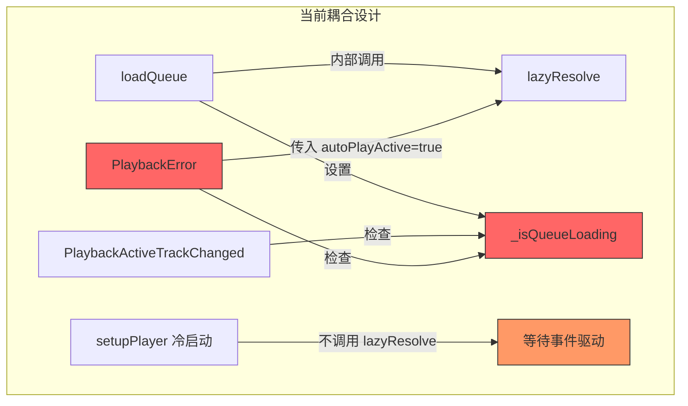
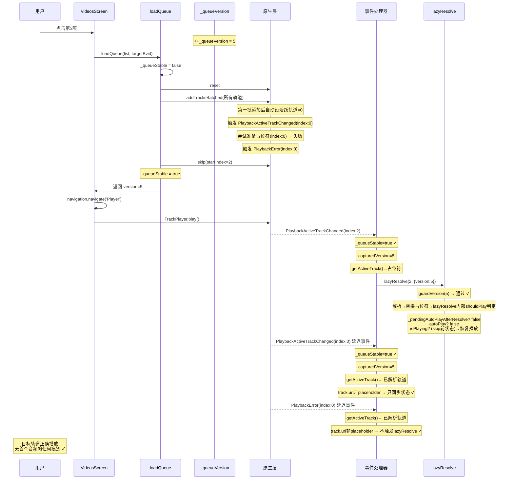
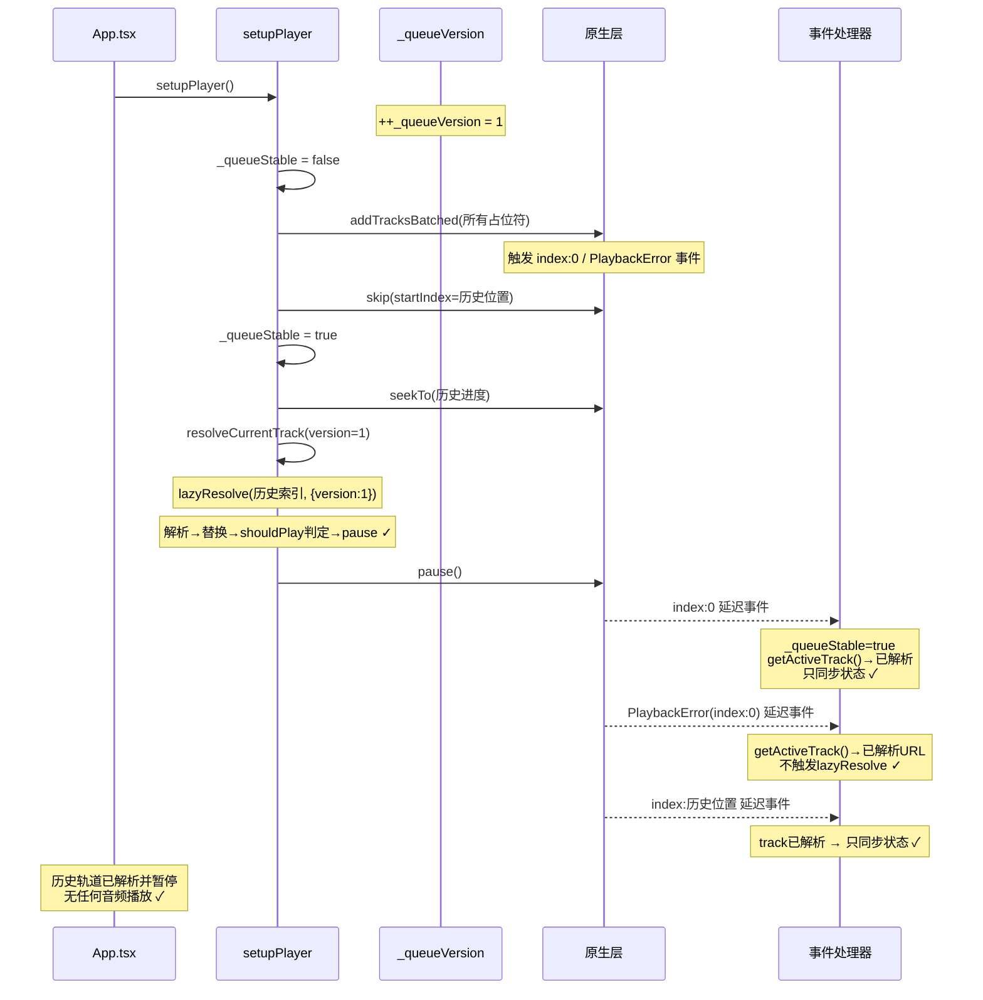

# 播放器初始化与状态路由缺陷 - 根因分析与修复方案（v2）

## 一、问题概述

| 问题编号 | 症状 |
|---------|------|
| **P1** | 在 VideosScreen 点击非首位音频 → 首个音频被加载/播放 → 之后才加载目标音频 |
| **P2** | 冷启动恢复 → 收藏夹首个音频自动播放 → 切换到正确历史音频 → 暂停 |

---

## 二、根因分析（摘要）

### 2.1 核心缺陷：`_isQueueLoading` 布尔锁的时序窗口

React Native Bridge 的事件传递延迟不可预测。`_isQueueLoading = false` 之后，锁定期间产生的陈旧事件（`PlaybackActiveTrackChanged(index:0)`、`PlaybackError`）可能在任何时刻到达 JS 线程。

### 2.2 三条攻击路径

| # | 路径 | 后果 |
|---|------|------|
| ① | `PlaybackError` 处理器在锁释放后收到 index:0 的占位符错误 → `getActiveTrackIndex()` 返回到过渡态值 0 → `lazyResolve(0, true)` | **首个音频被自动播放** |
| ② | `PlaybackActiveTrackChanged` 处理器收到延迟的 index:0 事件 → 活跃索引恰在过渡态匹配 → `lazyResolve(0, false)` 内部 add/skip/remove 级联 | **首个音频被解析后替换目标轨道** |
| ③ | `lazyResolve` 内部 `add/skip/remove` 产生的级联事件在锁外与陈旧事件混合到达 | **非确定性播放顺序** |

### 2.3 当前代码中的设计耦合



---

## 三、修复方案（10 条优化建议全覆盖）

### 设计原则

```
1. 单一版本源：仅 _queueVersion 一个代际字段，无冗余
2. 职责分离：loadQueue 只建队列，解析由独立入口触发
3. 静默优先：所有 lazyResolve 默认不播放，播放由显式调用方决定
4. 版本门禁：所有异步路径在入口 + 关键 await 后 + 最终操作前三重校验
5. 统一出口：播放决策收敛到单一 shouldPlay 判定点
```

### 3.1 状态变量设计（修改 1）

**文件**：`src/services/trackPlayer.ts`

**位置**：第 23-36 行，全量替换模块级变量

```typescript
// ========== 删除以下变量 ==========
// let _isQueueLoading = false;        // 布尔锁 → 删除，有竞态窗口
// let _pendingPlay = false;           // 废弃，由调用方显式 play/pause
// let _pendingAutoPlayAfterResolve = false; // 保留但语义收窄

// ========== 新增/保留变量 ==========
/** 队列版本号：每次 loadQueue / setupPlayer 单调递增。
 *  所有异步回调（事件处理器、lazyResolve、预取）携带此版本号，
 *  一旦版本不匹配立即中止，从根本上消除陈旧事件竞态。 */
let _queueVersion = 0;

/** 队列是否已完成本次加载并稳定。
 *  - false：正在 addTracksBatched / skip 等操作中（事件过滤用）
 *  - true：队列结构已稳定，允许事件处理器进入版本校验 */
let _queueStable = false;

/** 占位符轨道因 PlaybackError 停止播放后，等待 lazyResolve 完成后恢复播放的标志。
 *  注意：这不是 autoPlay 参数传递者，而是 lazyResolve 内部 shouldPlay 判定的一项输入。
 *  由 PlaybackError 处理器设置，lazyResolve 完成时消费并重置。 */
let _pendingAutoPlayAfterResolve = false;

/** 连续解析失败的歌曲数，用于触发全局熔断（不变） */
let consecutiveTrackFailures = 0;
```

**关键变化**：
- 仅保留 `_queueVersion` 一个版本号字段——满足建议 1、2
- 新增 `_queueStable` 作为辅助门禁，用于在队列操作进行中快速屏蔽所有事件
- 消除 `_isQueueLoading` 和 `_pendingPlay`

---

### 3.2 统一版本校验函数（建议 10：统一出口）

**文件**：`src/services/trackPlayer.ts`

**位置**：新增，放在模块级变量声明之后

```typescript
/**
 * 统一版本门禁：所有涉及队列操作的异步路径在关键节点调用此函数。
 * 只要返回 false，调用方必须立即中止，不得继续操作 TrackPlayer。
 *
 * @param version  调用方携带的版本号
 * @param label    日志标签（用于问题定位）
 * @returns        版本是否仍然有效
 */
function guardVersion(version: number, label: string): boolean {
  if (version !== 0 && version !== _queueVersion) {
    LoggerService.info(
      'TrackPlayer',
      'guardVersion',
      `[${label}] 版本失效 (调用版本:${version} ≠ 当前版本:${_queueVersion})，中止操作`
    );
    return false;
  }
  return true;
}
```

**设计意图**：所有路径（事件处理器、lazyResolve、PlaybackError、预取回调）统一走这个门禁，不再各自散落判断逻辑。

---

### 3.3 重写 `loadQueue`（建议 8：职责分离）

**文件**：`src/services/trackPlayer.ts`

**位置**：第 150-185 行

```typescript
/**
 * 构建播放队列并跳转到目标轨道。
 *
 * 职责边界：
 * - 仅负责：reset → addTracksBatched → skip(startIndex) → 预取首曲数据
 * - 不负责：解析任何轨道（lazyResolve 由调用方或事件处理器显式触发）
 * - 不负责：播放或暂停（播放状态由调用方控制）
 *
 * 返回队列版本号，供调用方在后续操作中携带。
 */
export async function loadQueue(
  videos: FavoriteVideo[],
  startBvid?: string,
): Promise<number> {
  if (!videos || videos.length === 0) return _queueVersion;

  // 递增版本号：宣告新队列时代的开始
  const version = ++_queueVersion;
  _queueStable = false;
  // 清空残留的自动播放标志（上一代遗留）
  _pendingAutoPlayAfterResolve = false;

  try {
    await TrackPlayer.reset();

    const startIndex = Math.max(
      0,
      startBvid ? videos.findIndex((v) => v.bvid === startBvid) : 0,
    );

    const tracks = videos.map(buildPlaceholderTrack);
    await addTracksBatched(tracks);
    await TrackPlayer.skip(startIndex);

    // 首曲纯数据预取：提前获取音频 URL 存入内存缓存
    prefetchFirstTrack(startIndex).catch(() => {});

    return version;
  } finally {
    // 标记队列稳定，允许事件处理器进入版本校验阶段
    _queueStable = true;
    // 版本号已递增，后续到达的旧版本事件全部被 guardVersion 拦截
  }
}
```

**关键变化**：
- 不再调用 `lazyResolve`——满足建议 8
- 返回 `version` 给调用方携带
- `_queueStable` 从 `false` 切 `true`，而不依赖固定延迟——满足建议 7

---

### 3.4 新增 `resolveCurrentTrack`——独立入口

**文件**：`src/services/trackPlayer.ts`

**位置**：新增，放在 `loadQueue` 之后

```typescript
/**
 * 解析当前活跃轨道（静默，默认不播放）。
 *
 * 与 loadQueue 解耦：此函数由调用方在适当时机显式调用。
 *
 * 使用场景：
 * - 冷启动恢复：loadQueue → resolveCurrentTrack(version) → pause
 * - VideosScreen::playFrom：loadQueue → play → 事件驱动 lazyResolve
 * - PlaybackError 恢复：由事件处理器标记 _pendingAutoPlayAfterResolve → 触发 lazyResolve
 *
 * @param version  调用方持有的队列版本号
 */
export async function resolveCurrentTrack(version: number): Promise<void> {
  if (!guardVersion(version, 'resolveCurrentTrack')) return;

  try {
    const index = await TrackPlayer.getActiveTrackIndex();
    if (typeof index !== 'number' || index < 0) return;

    // 二次版本校验：getActiveTrackIndex 是 Bridge 调用，版本可能已变
    if (!guardVersion(version, 'resolveCurrentTrack:postBridge')) return;

    await lazyResolve(index, { version });
  } catch (e) {
    LoggerService.error('TrackPlayer', 'resolveCurrentTrack', '静默解析失败:', e);
  }
}
```

---

### 3.5 重写 `setupPlayer` 冷启动恢复（建议 9：静默恢复路径）

**文件**：`src/services/trackPlayer.ts`

**位置**：第 82-128 行（`setupPlayer` 函数内）

```typescript
export async function setupPlayer() {
  if (_ready) return;
  try {
    // ... TrackPlayer.setupPlayer / updateOptions 保持不变 ...

    // ========== AppState 监听保持不变 ==========

    // ========== Zustand hydration 等待保持不变 ==========

    const store = usePlayerStore.getState();
    if (store.queue && store.queue.length > 0) {
      // 【冷启动静默恢复】
      // 1. 构建队列 + 定位到历史音频位置
      // 2. 静默解析目标轨道（仅填充 URL，不播放）
      // 3. 恢复进度
      // 4. 保持暂停
      // 全程不触发任何首位音频的预加载或自动播放

      const version = ++_queueVersion;
      _queueStable = false;
      _pendingAutoPlayAfterResolve = false;

      try {
        const tracks = store.queue.map(buildPlaceholderTrack);
        await addTracksBatched(tracks);

        const startIndex = Math.max(
          0,
          store.queue.findIndex((v) => v.bvid === store.currentBvid),
        );
        await TrackPlayer.skip(startIndex);

        _queueStable = true;

        // 静默恢复进度
        const lastPosition = storage.getNumber('lastPlaybackPosition');
        if (lastPosition && lastPosition > 0) {
          await TrackPlayer.seekTo(lastPosition);
        }

        // 静默解析目标轨道（不播放）
        await resolveCurrentTrack(version);

        // 最终保险：强制执行暂停
        await TrackPlayer.pause();
      } finally {
        _queueStable = true;
      }
    }
  } catch (e) {
    LoggerService.error('TrackPlayer', 'setupPlayer', 'setupPlayer error:', e);
  }
  _ready = true;
}
```

**关键变化**：
- 冷启动恢复主动调用 `resolveCurrentTrack`（静默解析），不再依赖后续事件驱动——满足建议 9
- 不再有 `_isQueueLoading` 锁机制
- `_pendingAutoPlayAfterResolve` 在入口处被清空
- 整个恢复流程闭合在 `try/finally` 内，版本号一次到位

---

### 3.6 重写 `lazyResolve`（建议 4、5：静默解析 + 版本三重校验）

**文件**：`src/services/trackPlayer.ts`

**位置**：第 342 行起

```typescript
/**
 * 选项对象（替代 bool 参数，语义更明确）
 */
interface LazyResolveOptions {
  /** 调用方持有的队列版本号 */
  version: number;
  /** 是否在解析完成后自动播放。
   *  仅在极少数场景（PlaybackError 恢复）可能为 true，
   *  绝大多数路径必须传 false。缺席时默认 false。 */
  autoPlay?: boolean;
}

/**
 * 解析指定索引的占位符轨道为真实音频 URL。
 *
 * 调用约定（硬规则）：
 * - autoPlay 缺席或 false：静默解析，完成后保持当前播放/暂停状态
 * - autoPlay 为 true：仅限 PlaybackError 恢复路径经 _pendingAutoPlayAfterResolve 间接达成
 * - 严禁任何调用方在非恢复场景传入 autoPlay=true
 *
 * 三重版本校验：
 * ① 入口立即校验（同步，零开销）
 * ② 每次 Bridge await 返回后校验（getActiveTrackIndex / getQueue / add / skip）
 * ③ 替换占位符前最终校验
 */
async function lazyResolve(
  index: number,
  options: LazyResolveOptions,
): Promise<void> {
  const { version, autoPlay = false } = options;

  // ======== 第一重：入口版本校验 ========
  if (!guardVersion(version, `lazyResolve:entry(idx=${index})`)) return;

  // 防止同一索引并发解析
  if (resolving.has(index)) return;
  resolving.add(index);

  let bvid = '';
  let isActiveTrack = false;
  try {
    // ======== Bridge 调用 1 ========
    const activeIdx = await TrackPlayer.getActiveTrackIndex();
    if (activeIdx !== index) {
      // 活跃轨道已变更，本任务是过期的
      return;
    }
    // ======== 第二重：Bridge 返回后版本校验 ========
    if (!guardVersion(version, `lazyResolve:postActiveIdx(idx=${index})`)) return;

    isActiveTrack = true;
    usePlayerStore.getState().setResolving(true);

    // ======== Bridge 调用 2 ========
    const queue = await TrackPlayer.getQueue();
    if (!guardVersion(version, `lazyResolve:postGetQueue(idx=${index})`)) return;

    const t = queue[index];
    if (!t || !String(t.url).startsWith('placeholder://')) return;

    const rawId = String(t.url).replace('placeholder://', '');
    const [extractedBvid, cidStr] = rawId.split('-');
    bvid = extractedBvid;
    const cid = cidStr ? parseInt(cidStr, 10) : undefined;

    // 记录轨道开始加载时间
    performanceMonitor.start(bvid);
    const quality = useSettingsStore.getState().quality;
    const cacheKey = cid ? `${bvid}-${cid}` : bvid;

    // ======== URL 解析逻辑（不变） ========
    let url = '';
    let headers: Record<string, string> | undefined;
    let resolvedInfo: any = undefined;

    const cachedPath = await audioCache.has(cacheKey, quality);
    if (cachedPath) {
      url = `file://${cachedPath}`;
    } else {
      const cachedUrlEntry = getCachedUrl(bvid, cid);
      if (cachedUrlEntry) {
        url = cachedUrlEntry.url;
        headers = cachedUrlEntry.headers;
      } else {
        let resolveSuccess = false;
        let lastError: any = null;
        for (let attempt = 1; attempt <= 3; attempt++) {
          try {
            resolvedInfo = await audioService.getInfo(bvid, quality, cid);
            url = resolvedInfo.audio.baseUrl;
            headers = {
              Referer: config.referer,
              'User-Agent': config.userAgent,
            };
            setCachedUrl(bvid, url, headers, cid ?? resolvedInfo.cid);
            audioCache.download(cacheKey, quality, resolvedInfo.audio.baseUrl, {
              Referer: config.referer,
              'User-Agent': config.userAgent,
            }).catch(() => {});
            resolveSuccess = true;
            break;
          } catch (error) {
            lastError = error;
            if (error instanceof RateLimitError) break;
            if (attempt < 3) await new Promise((r) => setTimeout(r, 500));
          }
        }
        if (!resolveSuccess) {
          throw lastError || new Error('解析音频失败');
        }
      }
    }

    // ======== URL 解析后版本校验 ========
    if (!guardVersion(version, `lazyResolve:postResolve(idx=${index},bvid=${bvid})`)) return;

    // 异步解析完成后二次校验：确保当前活跃轨道仍然是目标轨道
    const currentActiveIdx = await TrackPlayer.getActiveTrackIndex();
    if (currentActiveIdx !== index) {
      LoggerService.info(
        'TrackPlayer',
        'lazyResolve',
        `解析完成但活跃轨道已变更 (期望:${index} 实际:${currentActiveIdx})，放弃本次替换`,
      );
      return;
    }
    if (!guardVersion(version, `lazyResolve:postActiveIdx2(idx=${index})`)) return;

    // ======== 多P视频动态队列展开逻辑（不变） ========
    // ... 保持原有逻辑 ...

    // ======== 动态查找当前 placeholder 的实际索引 ========
    const freshQueue = await TrackPlayer.getQueue();
    if (!guardVersion(version, `lazyResolve:postFreshQueue(idx=${index})`)) return;

    const actualIndex = freshQueue.findIndex(
      (tr) => tr.id === bvid && String(tr.url).startsWith('placeholder://'),
    );
    if (actualIndex === -1) return;

    // ======== 构建替换轨道 ========
    let effectiveCid = cid;
    let title = t.title;
    if (!cid && videoInfo?.parts && videoInfo.parts.length > 0) {
      effectiveCid = videoInfo.parts[0].cid;
      title = `${videoInfo.title} - ${videoInfo.parts[0].title}`;
    }
    const newTrack: any = {
      ...t,
      url,
      title,
      userAgent: config.userAgent,
      headers,
      cid: effectiveCid,
    };

    // ======== 第三重：替换前最终版本校验 ========
    if (!guardVersion(version, `lazyResolve:preReplace(idx=${index})`)) return;

    // ======== 占位符替换逻辑 ========
    if (isActiveTrack) {
      // 当前播放的就是占位符 → 插入真实轨道 + skip + remove
      await TrackPlayer.add(newTrack, actualIndex + 1);

      // 记录 skip 前的播放状态
      const playbackState = await TrackPlayer.getPlaybackState();
      const isPlaying =
        playbackState.state === State.Playing ||
        playbackState.state === State.Buffering;

      await TrackPlayer.skip(actualIndex + 1);

      // ======== 统一播放决策（建议 10：统一出口） ========
      // 三条规则按优先级：
      // 1. _pendingAutoPlayAfterResolve（PlaybackError 恢复标志）→ 需恢复播放
      // 2. autoPlay（仅 PlaybackError 路径通过标志间接达成，此处为防御性检查）
      // 3. skip 前正在播放 → 恢复播放（用户主动操作中）
      // 其他情况：保持暂停
      const shouldResumePlay =
        _pendingAutoPlayAfterResolve || autoPlay || isPlaying;

      // 消费恢复标志
      if (_pendingAutoPlayAfterResolve) {
        _pendingAutoPlayAfterResolve = false;
      }

      if (shouldResumePlay) {
        await TrackPlayer.play();
      } else {
        await TrackPlayer.pause();
      }
      await TrackPlayer.remove(actualIndex);
    } else {
      // 非活跃轨道 → 直接替换（remove + add），不触发事件级联
      await TrackPlayer.remove(actualIndex);
      await TrackPlayer.add(newTrack, actualIndex);
      // PlaybackError 恢复逻辑
      if (_pendingAutoPlayAfterResolve) {
        _pendingAutoPlayAfterResolve = false;
        await TrackPlayer.play().catch(() => {});
      }
    }
  } catch (error) {
    LoggerService.error('TrackPlayer', 'lazyResolve', `解析音频失败 (BVID: ${bvid}):`, error);
    // ... 错误处理逻辑保持不变（无网络、限流熔断、连续失败熔断、skipToNext）...
  } finally {
    if (isActiveTrack) {
      usePlayerStore.getState().setResolving(false);
    }
    resolving.delete(index);
  }
}
```

**关键变化**：
- 签名从 `(index, autoPlayActive, generation)` 改为 `(index, options: LazyResolveOptions)`——满足建议 4
- 三重 `guardVersion` 校验分别在入口、Bridge 返回后、替换前——满足建议 5
- `autoPlay` 默认 `false`，且调用语义收紧——满足建议 4
- 播放决策统一到一处 `shouldResumePlay` 三段判定——满足建议 10

---

### 3.7 重写 `PlaybackActiveTrackChanged` 事件处理器（建议 6）

**文件**：`src/services/trackPlayer.ts`

**位置**：第 640-721 行

```typescript
TrackPlayer.addEventListener(Event.PlaybackActiveTrackChanged, async (e) => {
  if (e.index === undefined) return;

  // ======== 门禁 1：队列是否已稳定 ========
  if (!_queueStable) {
    LoggerService.info(
      'TrackPlayer',
      'PlaybackActiveTrackChanged',
      `队列未稳定，屏蔽事件 (index:${e.index})`,
    );
    return;
  }

  // ======== 门禁 2：捕获当前版本号 ========
  const capturedVersion = _queueVersion;
  if (capturedVersion === 0) return;

  // ======== 门禁 3：获取当前活跃轨道作为辅助判断 ========
  // 注意：getActiveTrackIndex() 仅作为辅助依据，不是绝对真相。
  // 真正可靠的过滤靠 _queueVersion 代际校验。
  const activeTrack = await TrackPlayer.getActiveTrack();
  if (!guardVersion(capturedVersion, `PlaybackActiveTrackChanged(idx=${e.index})`)) return;

  // ======== 辅助判断：用轨道 URL 和 id 交叉验证 ========
  if (!activeTrack?.id) return;

  // ======== 路径 A：轨道已解析 → 仅同步状态 + 预取 ========
  if (activeTrack.url && !String(activeTrack.url).startsWith('placeholder://')) {
    const bvid = activeTrack.id as string;
    performanceMonitor.start(bvid);
    usePlayerStore.getState().setCurrentBvid(bvid);

    const trackCid = (activeTrack as any).cid;
    if (typeof trackCid === 'number') {
      usePlayerStore.getState().setCurrentCid(trackCid);
    } else {
      usePlayerStore.getState().setCurrentCid(null);
    }

    prefetchNextTracks(e.index).catch(() => {});
    if (e.lastTrack?.id) autoCache(e.lastTrack.id as string);
    return;
  }

  // ======== 路径 B：轨道是占位符 → 静默解析（不自动播放） ========
  const bvid = activeTrack.id as string;
  performanceMonitor.start(bvid);
  usePlayerStore.getState().setCurrentBvid(bvid);

  // 同步 cid（与原有逻辑一致）
  const trackCid = (activeTrack as any).cid;
  if (typeof trackCid === 'number') {
    usePlayerStore.getState().setCurrentCid(trackCid);
  } else if (activeTrack.url && typeof activeTrack.url === 'string') {
    const urlStr = activeTrack.url;
    if (urlStr.startsWith('placeholder://')) {
      const rawId = urlStr.replace('placeholder://', '');
      const parts = rawId.split('-');
      if (parts.length >= 2) {
        const cid = parseInt(parts[1], 10);
        if (!isNaN(cid)) {
          usePlayerStore.getState().setCurrentCid(cid);
        }
      }
    } else {
      usePlayerStore.getState().setCurrentCid(null);
    }
  }

  // 静默解析：autoPlay 缺省 = false
  await lazyResolve(e.index, { version: capturedVersion });

  prefetchNextTracks(e.index).catch(() => {});
  if (e.lastTrack?.id) autoCache(e.lastTrack.id as string);
});
```

**关键变化**：
- 不再用 `getActiveTrackIndex()` 做绝对校验——满足建议 6
- 改用 `getActiveTrack()` 获取轨道对象，用 URL 内容做交叉验证
- 所有路径统一先捕获版本号，后续通过 `guardVersion` 过滤

---

### 3.8 重写 `PlaybackError` 事件处理器（建议 3）

**文件**：`src/services/trackPlayer.ts`

**位置**：第 723-769 行

```typescript
TrackPlayer.addEventListener(Event.PlaybackError, async (error) => {
  // ======== 门禁 1：队列是否已稳定 ========
  if (!_queueStable) {
    LoggerService.info(
      'TrackPlayer',
      'PlaybackError',
      '队列未稳定，忽略播放错误',
    );
    return;
  }

  // ======== 门禁 2：捕获当前版本号 ========
  const capturedVersion = _queueVersion;
  if (capturedVersion === 0) return;

  // ======== 核心逻辑：判断错误是否来自占位符轨道 ========
  try {
    const activeTrack = await TrackPlayer.getActiveTrack();
    if (!guardVersion(capturedVersion, 'PlaybackError:postActiveTrack')) return;

    if (
      activeTrack &&
      typeof activeTrack.url === 'string' &&
      activeTrack.url.startsWith('placeholder://')
    ) {
      LoggerService.info(
        'TrackPlayer',
        'PlaybackError',
        '检测到占位符轨道播放错误，触发补解析',
      );

      // 【建议 3】仅设置恢复标志，不传递 autoPlay=true
      // 真正是否播放由 lazyResolve 内部的 shouldResumePlay 三段判定决定
      _pendingAutoPlayAfterResolve = true;

      const activeIndex = await TrackPlayer.getActiveTrackIndex();
      if (!guardVersion(capturedVersion, 'PlaybackError:postActiveIndex')) return;

      if (typeof activeIndex === 'number' && activeIndex >= 0) {
        // autoPlay 缺省 = false，由 _pendingAutoPlayAfterResolve 标志驱动恢复播放
        lazyResolve(activeIndex, { version: capturedVersion }).catch(() => {
          // 解析失败时的兜底：尝试直接恢复播放
          if (_pendingAutoPlayAfterResolve) {
            _pendingAutoPlayAfterResolve = false;
            TrackPlayer.play().catch(() => {});
          }
        });
      }
      return;
    }
  } catch (e) {
    // 检查失败，走通用错误处理
  }

  // ======== 通用错误处理路径 ========
  LoggerService.error('TrackPlayer', 'PlaybackError', '播放错误:', error);

  if (netStatus.type === 'none') {
    usePlayerStore.getState().setPlaybackError('网络已断开，播放暂停');
    await TrackPlayer.pause();
    return;
  }

  await TrackPlayer.skipToNext().catch(() => {});
});
```

**关键变化**：
- `lazyResolve` 的 `autoPlay` 不再由 PlaybackError 传入 `true`——满足建议 3
- 改为设置 `_pendingAutoPlayAfterResolve = true`，由 lazyResolve 内部的统一 shouldPlay 出口处理
- PlaybackError 职责收窄为：判断是否需要补解析 + 设置恢复标志

---

### 3.9 `VideosScreen` 调用方适配（建议 8：分离解析）

**文件**：`src/screens/VideosScreen.tsx`

**位置**：`playFrom` / `playAll` / `shuffle` 函数

```typescript
const playFrom = useCallback(async (idx: number) => {
  try {
    const target = displayedList[idx];
    if (!target) return;
    const context = { folderId: mediaId, sortOption, searchQuery };

    if (usePlayerStore.getState().playMode !== 'sequential') {
      usePlayerStore.getState().setPlayMode('sequential');
    }

    setQueue(displayedList, target.bvid, context);

    // 【建议 8】loadQueue 不再内置 lazyResolve，仅建队列
    await loadQueue(displayedList, target.bvid);

    // 导航到播放器（队列已就绪，TrackPlayer 中目标索引已设置）
    navigation.navigate('Player');

    // 显式播放：触发 PlaybackActiveTrackChanged → 事件处理器 → lazyResolve（静默）
    await TrackPlayer.play();

    // 后台异步加载更多
    usePlayerStore.getState().setQueueLoading(true);
    loadMoreInBackground().catch(() => {
      usePlayerStore.getState().setQueueLoading(false);
    });
  } catch (e: any) {
    // ... 错误处理不变 ...
  }
}, [displayedList, mediaId, sortOption, searchQuery, loadMoreInBackground]);
```

**关键变化**：
- `loadQueue` 不再承担解析职责
- 流程变为：建队列 → 导航 → 播放（事件驱动解析）
- 由于版本过滤 + `_queueStable` 保护，index:0 的陈旧事件无法突破

---

## 四、完整修改文件清单

| 文件 | 修改范围 | 风险等级 |
|------|---------|---------|
| `src/services/trackPlayer.ts` | 全面重构（~300 行变更） | 高 |
| `src/screens/VideosScreen.tsx` | `playFrom`/`playAll`/`shuffle` 三处调用适配 | 低 |

**不需要修改的文件**：
- `src/components/PlaylistPanel.tsx` — `TrackPlayer.skip/play` 直接调用不变
- `src/screens/PlayerScreen.tsx` — 仅消费 Zustand store 和 TrackPlayer hooks
- `src/App.tsx` — `setupPlayer()` 签名不变
- `src/store/playerStore.ts` — 不受影响

---

## 五、修复后架构流程图



---

## 六、冷启动恢复修复后流程图



---

## 七、测试验证方案

### P1 验证：跨页面点击非首位
1. 打开任意收藏夹（至少 5 首歌曲）
2. 点击第 3 首
3. **期望**：立即跳转到 PlayerScreen，封面为目标歌曲，无任何短暂闪烁为首个歌曲
4. 日志验证：`adb logcat | grep "guardVersion"` 应看到所有陈旧事件被拦截的记录

### P2 验证：冷启动恢复
1. 播放收藏夹第 3 首到 50% 位置
2. 完全关闭应用（从最近任务中划掉）
3. 重新打开应用
4. **期望**：PlayerScreen 显示上次歌曲和进度，处于暂停状态，无短暂播放

### 回归测试
| 场景 | 预期 |
|------|------|
| "全部播放" | 从第 1 首开始正常播放 |
| 随机播放 | 正常 |
| PlaylistPanel 切歌 | 立即响应，仅加载目标 |
| 锁屏/通知栏切歌 | 正常 |
| 无网络 + 占位符错误 | 显示错误提示，不循环切歌 |
| 播放模式切换 | 正常 |
| 快速连续切歌 | 仅最后一首被解析（版本过滤拦截中间请求） |
