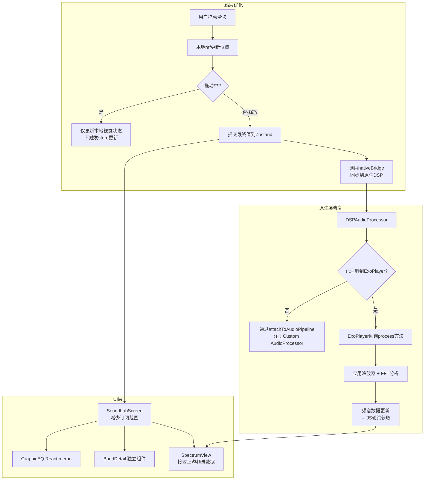

# SoundLabScreen 优化计划

## 现状分析

### 问题 1：Graphic EQ 滑块滑动卡顿

**根因分析：**

1. **全屏级联重渲染**：
   - [`SoundLabScreen`](src/screens/SoundLabScreen.tsx:39) 使用 `useEQStore(s => s.graphicBands)` 订阅整个频段数组
   - 拖动滑块时，每次节流提交后通过 [`setGraphicBand`](src/store/eqStore.ts:200) 调用 `set({ graphicBands: bands })`，Zustand 创建全新数组引用
   - 导致 `SoundLabScreen` 整组件重渲染，包括 [`ScrollView`](src/screens/SoundLabScreen.tsx:73)、[`SpectrumView`](src/screens/SoundLabScreen.tsx:100)、底部控制台等所有子组件
   - [`totalEnergy`](src/screens/SoundLabScreen.tsx:52) 每次渲染都重新计算整个数组

2. **热路径中的原生桥接调用**：
   - [`setGraphicBand`](src/store/eqStore.ts:204) 每次提交都调用 `audioDSP.updateGraphicEQ(bands)` → 原生 Bridge（成本 ~1-5ms）
   - 即使节流（阈值 0.5dB），快速拖动时仍可能密集触发

3. **Slider 组件问题**：
   - [`EQSlider`](src/components/eq/EQSlider.tsx:34) 使用 `value` prop 驱动填充百分比和颜色，但拖动中 rAF 循环每次提交后才更新 prop
   - [`onValutChange`](src/components/eq/GraphicEQ.tsx:35) 在拖动中频繁触发 store 更新

### 问题 2：PEQ 滤波器编辑卡顿

- [`PEQFilterEditor`](src/components/eq/PEQFilterEditor.tsx:44) 中的 [`DragSlider`](src/components/eq/PEQFilterEditor.tsx:256) 有类似节流机制，但每次 `updatePEQFilter` 同样触发 store 更新 + 原生 Bridge
- [`ParametricEQ`](src/components/eq/ParametricEQ.tsx:91) 拖动节点时每次移动都调用 `updatePEQFilter`，每帧重新计算 `curvePoints`

### 问题 3：EQ 调整未实时生效

**根因：**
- [`DSPAudioProcessor`](android/app/src/main/java/com/bilimusic/audio/DSPAudioProcessor.kt:22) 的 `process()` 方法**未集成到音频播放管线**中
- 注释明确说明：*"在集成阶段需要通过自定义 AudioProcessor 注册到 TrackPlayer 的 MediaSource 中。当前实现提供完整的 DSP 逻辑"*
- [`setGraphicBand`](src/store/eqStore.ts:204) 调用原生 Bridge 更新了滤波器系数，但由于 DSP 处理器不在音频回放链中，滤波器变更不影响实际播放的音频
- 同样地，[`updatePEQFilter`](src/store/eqStore.ts:231) 的更新也不生效

### 问题 4：实时频谱无法显示

**根因：**
- [`useSpectrumPoller`](src/hooks/useSpectrumPoller.ts:57) 每 80ms 调用 `audioDSP.getSpectrumData()` 获取频谱数据
- 原生 [`getSpectrumData`](android/app/src/main/java/com/bilimusic/module/AudioDSPModule.kt:84) 从 `dspProcessor.fftAnalyzer.spectrum` 读取
- FFT 分析器的 [`analyze()`](android/app/src/main/java/com/bilimusic/audio/FFTAnalyzer.kt:45) 仅在 `DSPAudioProcessor.process()` 中被调用
- 由于 DSP 处理器不在音频管线中，`process()` 从未被调用 → FFT 分析器永远收不到 PCM 数据 → `spectrum` 全零
- [`SpectrumView`](src/components/eq/SpectrumView.tsx:48) 检测到空闲状态，一直显示引导占位层

### 问题 5：新增杜比全景声和 HI-FES 无损音质选项

**当前状态：**
- [`Quality`](src/types/domain.ts:1) 类型仅包含 `'low' | 'medium' | 'high'`
- [`QUALITY_OPTIONS`](src/screens/SettingsScreen.tsx:28) 仅三个选项
- [`QUALITY_MAP`](src/services/audioService.ts:8) 映射 B 站音频质量码
- 无杜比/无损选项，无会员检测逻辑

---

## 优化方案

### Task 1：优化 Graphic EQ 滑块滑动性能

#### 1.1 分离频段详情组件
- 将 [`BandDetail`](src/screens/SoundLabScreen.tsx:114-153) 提取为独立的 `React.memo` 组件
- 避免主组件重渲染时每次都重建频段详情列表

#### 1.2 优化 `SoundLabScreen` 减少订阅范围
- 将 `graphicBands` 的订阅下放到 [`GraphicEQ`](src/components/eq/GraphicEQ.tsx) 组件内部
- `SoundLabScreen` 不再订阅 `graphicBands`，只保留 `mode`/`enabled` 等变化不频繁的状态

#### 1.3 为 `GraphicEQ` 添加 `React.memo`
```tsx
export const GraphicEQ = React.memo(() => { ... });
```
- 使用 `arePropsEqual` 自定义比较函数，仅比较 `enabled` 和 `graphicBands` 引用

#### 1.4 优化 `EQSlider` - 采用"释放时提交"模式
- 拖动过程中仅更新本地 ref 和动画值，不触发 `onValueChange`
- 仅在 `onPanResponderRelease`/`onPanResponderTerminate` 时提交最终值
- 保留 rAF 循环用于更新视觉反馈（颜色、发光），但不调用 `onValueChange`
- 移除 `THROTTLE_THRESHOLD` 节流逻辑（释放时直接提交）

#### 1.5 优化 `eqStore.setGraphicBand`
- 移除热路径中的 `audioDSP.updateGraphicEQ(bands)` 调用
- 改为在释放时由组件显式调用批处理方法 `syncGraphicEQToNative()`

#### 1.6 移除 `totalEnergy` 实时计算
- `totalEnergy` 计算在拖动中不必要地增加渲染负担
- 改为在静态显示区域使用惰性计算或移除

### Task 2：优化 PEQ 滤波器编辑滑块性能

#### 2.1 优化 `ParametricEQ` 的拖动响应
- [`DraggableNode`](src/components/eq/ParametricEQ.tsx:282) 的 `onDrag` 在 `onPanResponderMove` 中每帧触发
- 改为拖动中仅在 ref 中累积偏移量，释放时统一提交
- 频率/增益的实时视觉反馈通过本地 ref 驱动的绝对定位实现（不依赖 Zustand re-render）

#### 2.2 优化 `PEQFilterEditor` 的 `DragSlider`
- 类似 EQSlider 的"释放时提交"模式
- 当前已有 rAF + 节流，但 `updatePEQFilter` 仍触发 store 更新
- 改为拖动期间更新本地 ref 驱动的视觉位置，释放时提交一次

#### 2.3 优化 `updatePEQFilter` 调用频率
- 将 `updatePEQFilter` 改为仅在释放时调用原生 Bridge
- 参数更新使用新的 `batchUpdatePEQFilters()` 方法批量同步到原生

### Task 3：确保 EQ 调整实时生效

#### 3.1 原生层：注册 Custom AudioProcessor 到 ExoPlayer
- 在 [`AudioDSPModule`](android/app/src/main/java/com/bilimusic/module/AudioDSPModule.kt:18) 中添加方法将 `DSPAudioProcessor` 注册到 TrackPlayer 的 ExoPlayer 实例
- 这需要：
  - 获取 TrackPlayer 内部的 ExoPlayer 实例引用
  - 创建自定义 `AudioProcessor` 包装 `DSPAudioProcessor`
  - 通过 `AudioProcessorChain` 注册

**具体实施：**
```kotlin
// 新增方法 - 连接到 TrackPlayer 的音频管线
@ReactMethod
fun attachToAudioPipeline() {
    // 1. 通过反射或 TrackPlayer API 获取 ExoPlayer 实例
    // 2. 创建 AudioProcessor 包装 DSPAudioProcessor.process()
    // 3. 注册到音频处理器链
}
```

#### 3.2 JS 层：连接 EQ 变更到 DSP
- 确保 [`setGraphicBand`](src/store/eqStore.ts:200) 和 [`updatePEQFilter`](src/store/eqStore.ts:231) 调用后，原生 DSP 立即生效
- 添加 `forceUpdateDSP()` 方法在 EQ 状态恢复/预设切换后强制同步

### Task 4：修复实时频谱显示问题

#### 4.1 原生层：建立 FFT 数据源连接
- 核心问题：`FFTAnalyzer.analyze()` 未被调用
- 解决方案：当 DSP 处理器集成到 ExoPlayer 管线后，FFT 分析器自然能获取 PCM 数据
- 具体步骤：
  1. 在 `DSPAudioProcessor.process()` 中始终执行 `fftAnalyzer.analyze(buffer, channels)`——**这已经实现了**
  2. 确保 `process()` 在音频回放时被 ExoPlayer 回调——**这是缺失的环节**

#### 4.2 备选方案：创建一个独立的 PCM 数据提取器
- 如果无法直接集成到 ExoPlayer，可考虑：
  - 使用 `AudioRecord` 或 `Visualizer` 从音频会话捕获 PCM 数据
  - 但 `Visualizer` 需要 API 级别较高，且受设备限制
  
#### 4.3 JS 层优化频谱轮询
- 当前 [`useSpectrumPoller`](src/hooks/useSpectrumPoller.ts) 的轮询间隔 80ms
- 当频谱数据源问题修复后，可考虑根据播放状态动态调整轮询频率：
  - 播放中：80ms
  - 暂停/停止：停止轮询（减少无用开销）

### Task 5：新增杜比全景声和 HI-FES 无损音质选项

#### 5.1 扩展 `Quality` 类型
```typescript
// src/types/domain.ts
export type Quality = 'low' | 'medium' | 'high' | 'dolby_atmos' | 'hires_lossless';
```

#### 5.2 更新 `audioService.ts` 质量映射
```typescript
const QUALITY_MAP: Record<Quality, number> = {
  low: 30216,          // 64 K
  medium: 30232,       // 132 K
  high: 30280,         // 192 K
  dolby_atmos: 30250,  // 杜比全景声（大会员）
  hires_lossless: 30251, // HI-FES 无损（大会员）
};
```

#### 5.3 更新 `SettingsScreen.tsx`
- 在 [`QUALITY_OPTIONS`](src/screens/SettingsScreen.tsx:28) 中添加两个新选项
- 使用 [`useAuthStore`](src/store/authStore.ts:37) 的 `loggedIn` 状态判断会员身份
- 动态控制选项的可交互状态：
  - 普通用户：选项文字置灰，`disabled` 阻止点击
  - 大会员用户：正常可用

```tsx
const isVip = loggedIn && userInfo?.vipStatus === 1; // 假设 vipStatus 标识会员

const QUALITY_OPTIONS = [
  // ... 现有选项
  { 
    key: 'dolby_atmos', 
    title: '杜比全景声', 
    subtitle: isVip ? '沉浸式环绕声体验' : '开通大会员以使用',
    disabled: !isVip,
  },
  { 
    key: 'hires_lossless', 
    title: 'HI-FES 无损', 
    subtitle: isVip ? '192kHz/24bit 高解析度无损' : '开通大会员以使用',
    disabled: !isVip,
  },
];
```

#### 5.4 更新 `authStore` 添加会员状态
- 扩展 [`UserInfo`](src/store/authStore.ts:5) 接口添加 `vipStatus` 字段
- 在 [`login`](src/store/authStore.ts:58) 和 [`initAuth`](src/store/authStore.ts:42) 中从 B 站 API 获取会员状态

#### 5.5 更新 `biliApi.ts`（如需要）
- 确保 `/x/web-interface/nav` 等用户信息接口返回 `vip_status` 字段
- 或单独调用会员信息接口

---

## 架构变更图



## 涉及文件清单

| 文件 | 修改内容 |
|------|---------|
| [`src/components/eq/EQSlider.tsx`](src/components/eq/EQSlider.tsx) | 改为释放时提交模式，拖动中仅更新本地视觉 |
| [`src/components/eq/GraphicEQ.tsx`](src/components/eq/GraphicEQ.tsx) | 添加 React.memo 包装 |
| [`src/screens/SoundLabScreen.tsx`](src/screens/SoundLabScreen.tsx) | 减少 graphicBands 订阅，提取 BandDetail 组件 |
| [`src/store/eqStore.ts`](src/store/eqStore.ts) | 添加 batch 同步方法，分离 UI 更新和原生同步 |
| [`src/components/eq/ParametricEQ.tsx`](src/components/eq/ParametricEQ.tsx) | DraggableNode 改为释放时提交 |
| [`src/components/eq/PEQFilterEditor.tsx`](src/components/eq/PEQFilterEditor.tsx) | DragSlider 改为释放时提交 |
| [`android/app/src/main/java/com/bilimusic/module/AudioDSPModule.kt`](android/app/src/main/java/com/bilimusic/module/AudioDSPModule.kt) | 添加 attachToAudioPipeline 方法 |
| [`android/app/src/main/java/com/bilimusic/audio/DSPAudioProcessor.kt`](android/app/src/main/java/com/bilimusic/audio/DSPAudioProcessor.kt) | 确认 process() 始终调用 FFT 分析（已实现） |
| [`src/types/domain.ts`](src/types/domain.ts) | Quality 类型扩展 |
| [`src/store/settingsStore.ts`](src/store/settingsStore.ts) | 无变更（泛型自动适配） |
| [`src/screens/SettingsScreen.tsx`](src/screens/SettingsScreen.tsx) | 添加杜比/无损选项 + 会员状态控制 |
| [`src/store/authStore.ts`](src/store/authStore.ts) | 添加会员状态字段 |
| [`src/services/audioService.ts`](src/services/audioService.ts) | QUALITY_MAP 新增杜比/无损码 |

## 注意事项

1. **原生层修改需要 APK 重新打包**：Task 3 和 Task 4 的修复涉及 Kotlin 原生代码修改，必须在 Android 真机/模拟器上重新构建 APK 才能验证
2. **B 站 API 质量码确认**：30250/30251 的映射可能需要实际验证 B 站 API 返回的可用音频流
3. **会员状态字段名**：需确认 B 站 `/x/web-interface/nav` 接口返回的 JSON 中会员字段名（可能是 `vip_status` 或 `vipType`）
4. **频谱数据源**：核心阻塞点是 DSP 处理器未接入 ExoPlayer 管线，这可能涉及对 `react-native-track-player` 原生代码的修改或自定义 ExoPlayer 扩展
